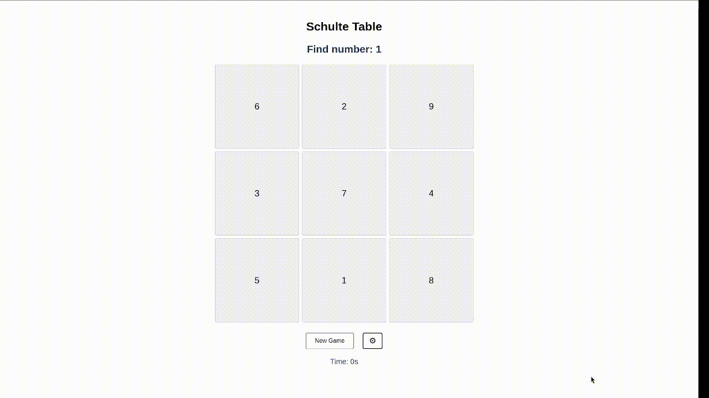

Schulte tables are a game for training your peripheral vision. To start playing, click the 'New Game' button. The number you need to find is shown above the table. To win, click all the numbers in the table in ascending order. Below the buttons, the time from the start of the game is shown; it stops when you win.

